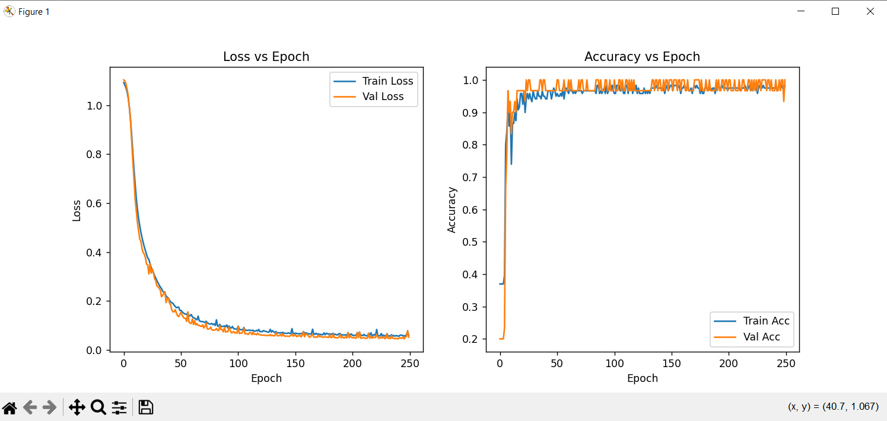
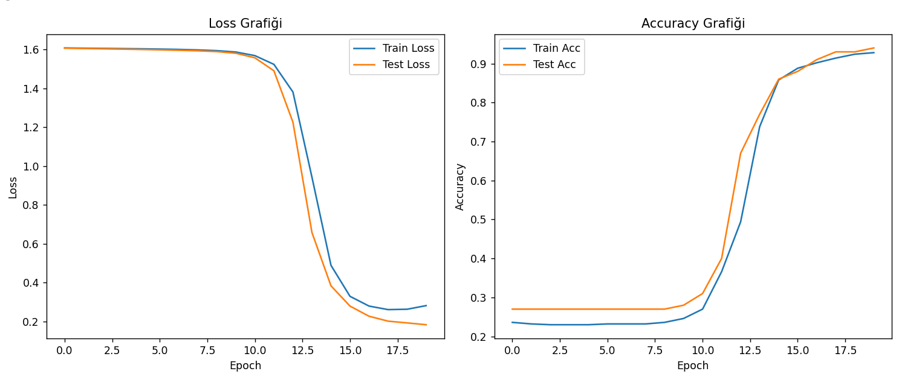
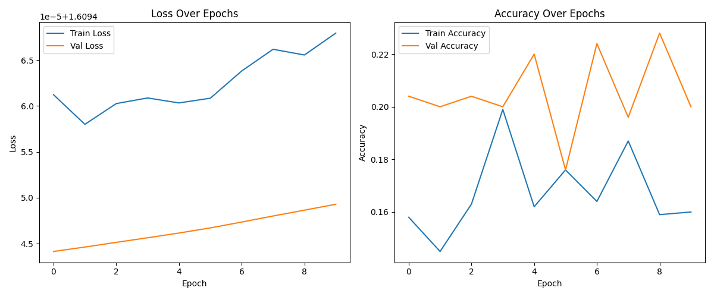

# 🧠 ARdL — Minimal Deep Learning Library (NumPy Only)

**ARdL**, saf **NumPy** kullanılarak sıfırdan yazılmış, küçük veri setleri üzerinde derin öğrenme (Deep Learning) algoritmalarını anlamak ve denemek için oluşturulmuş özel bir projedir.  
Bu kütüphane, hem **Yapay Sinir Ağlarını (NN / MLP)** hem de **Konvolüsyonel Sinir Ağlarını (CNN)** destekler.

---

## 🚀 Özellikler | Features

- 💡 Pure NumPy implementation — no TensorFlow / PyTorch
- 🧩 Two models included:
  - Feedforward Neural Network (MLP)
  - Convolutional Neural Network (CNN)
- 🔁 Custom forward & backward propagation
- ⚙️ Adjustable hyperparameters (learning rate, epochs)
- 🧠 Educational — designed for learning, debugging and visualization
- 💾 Model Save - Load Model

---
## MLP İris Dataset Sonuçları

MLP modeli Iris veri setindeki örüntüleri başarıyla öğrenmiştir 
ve test kümesinde **%96’nın üzerinde doğruluk** elde etmiştir.  
Bu, tam bağlı basit bir yapay sinir ağının bile 
yapılandırılmış veriler üzerinde etkili sonuçlar verebileceğini gösterir.

## Model Kaydetmek ve Yüklemek 
### Save
np.savez("mlp_model.npz", weights=W_dense, biases=b_dense)

### Load
data = np.load("mlp_model.npz", allow_pickle=True)
W_dense_loaded = data['weights']
b_dense_loaded = data['biases']

---
## MLP Nasıl Çalışır? | How the NN Works
### Forward Propagation:

**Tr:**
Girdi verisini alır ve rastgele ağırlıklara sahip bir yapay sinir ağından geçirir, aktivasyon fonksiyonları uygulanır.
Bu sırada loss (kayıp) fonksiyonları ile hatalar hesaplanır.
Bu projede kayıp fonksiyonu sadece CategoricalCrossEntropy’dir.

**En:**
The input data is passed once through a neural network with randomly initialized weights.
Activation functions are applied at each layer.
Meanwhile, a loss function calculates the model's error.
In this project, the only loss function used is Categorical Cross Entropy.

### Back Propagation:

**Tr:**
Hesaplanan kayıplar (hatalar) ile learning rate çarpılır, bunların türevleri (gradyanları) alınır.
Yapay sinir ağındaki her bir nöronun ağırlık ve bias sayıları, bu türevler üzerinden yeniden güncellenir.

**En:**
The calculated losses are multiplied by the learning rate, and the gradients (derivatives) are computed.
Based on these gradients, the neurons’ weights and biases are updated.

### Epochs:

**Tr:**
Forward Propagation ve Back Propagation, her döngüde veriye göre tekrar hesaplanır.
Hesaplanan değerler ile nöronların ağırlıkları ve bias sayıları, her adımda biraz daha istenen seviyeye gelir.

**En:**
During each epoch, the Forward and Back Propagation steps are repeated.
With each iteration, the weights and biases are adjusted closer to the desired values.

### Optimization

**Tr:**
Modelin öğrenmesini hızlandırmak ve daha doğru hale getirmek için optimizasyon algoritmaları kullanılır. 
En yaygın kullanılan algoritmalar arasında SGD (Stochastic Gradient Descent), Adam, RMSProp gibi yöntemler vardır.
Bu algoritmalar, ağırlık güncellemelerini daha verimli ve istikrarlı bir şekilde yapmamızı sağlar.

Şu anda bu projede kullanılan tek optimizasyon algoritması SGD (Stochastic Gradient Descent) dir. 

**En:**
Optimization algorithms are used to accelerate learning and improve model accuracy.
Common algorithms include SGD (Stochastic Gradient Descent), Adam, RMSProp, among others.
These methods make the weight updates more efficient and stable, helping the network converge faster and achieve 
better performance.

Currently the only optimization algorithm used in this project is SGD (Stochastic Gradient Descent).

---
# CNN Mnist Dataset Sonuçları 

20 epochda 0.001 lr değeri ile elde edilen sonuçlar
Epoch 20: Train Loss=0.2815, Train Acc=92.80% | Test Loss=0.1832, Test Acc=94.00%

---
## CNN Nasıl Çalışır | How the CNN works?

### Convolution 
**Tr:**
Girdi verisini, örnek olarak bir resmi alır. Ardından, önceden tanımlanmış Kernel (filtre) adı verilen küçük matrislerle
görseldeki pikseller çarpılır. Bu işlem, görselden özellik çıkarmak için yapılır. Kerneller piksellerle çarpıldığında,
görseldeki kenarlar, şekiller, renk geçişleri gibi resme özel olan özellikler, resimde daha baskın olarak gösterilir.

Kernel, bütün resmin pikselleri ile teker teker çarpıldığında, ortaya yeni bir resim çıkar. Buna feature map denir.
Feature map (özellik haritası), ana resimdeki kenar, şekil gibi özniteliklerin daha belirgin olarak gözüktüğü
yeni bir resimdir.

**En:**
The input data, for example an image, is taken and multiplied with small matrices called kernels (filters),
which are predefined. This operation is performed to extract features from the image.
When the kernels are multiplied with the pixels, the unique characteristics of the image — such as edges, shapes,
and color transitions — become more prominent in the resulting representation.

When the kernel is applied across all the pixels of the image, a new image is produced, called a feature map.
The feature map is a new version of the image where attributes like edges and shapes appear more clearly.

### ReLu (Rectified Linear Unit)
**Tr:**
Feature map üzerinde sıfırın altında değerler gösteren yerler de çıkacaktır ancak bu değerler genelde modeller için 
önemsizdir bu sebeple feature map a relu aktivasyonunu uygularız bu sıfırın altındaki değerleri sıfıra sabitler
ve sıfırın üzerindeki değerleri de aynen kendisine geri getirir elimizde artık yeni bir feature map var 
sıfırın altında değeri olmayan bu feature map artık poolinge girmee hazırdır 

**En:**
Some values in the feature map may be below zero, but these negative values are usually not important for the model.
Therefore, we apply the ReLU activation to the feature map. ReLU sets all negative values to zero while keeping positive values unchanged. 
The resulting feature map, now without negative values, is ready to be passed to the pooling layer.

### Pooling
**Tr:**
Elde ettiğimiz feature map bize özellikleri detaylıca gösterir ancak hem bu kadar detaylı özelliklere ihtiyaç olmaz 
hemde görselde gereksiz özellikler de barınır
Yüksek detaylı görüntüleri işlemek hem işlem gücünü boşa harcamak hemde eğitim süresini aşırı uzatmaya sebep olur 
bu yüzden yeni bir görsele ihtiyacımız olur daha küçük ama aradığımız özellikleri de içinde barındıran bir görsel
bu görseli elde edebilmek için pooling kullanırız feature map e GlobalAvgPool veya MaxPooling gibi pooling algoritmalarına
ihtiyaç duyarız Pooling algoritmaları ile görüntüdeki gereksiz özellikleri ve çok detaylı olan bu özellikleri filtrelemiş oluruz
bu yöntem ile hem yapay sinir ağımız öğrenmesi gereken veriye daha çok odaklanabilir hemde verinin boyutu azaldığı için 
iş yükümüz azalır 
Bu Projede kullanılan tek pooling algoritması MaxPooling dir 

**En:**
The obtained feature map shows the image features in detail; however, such a high level of detail is often unnecessary,
and redundant information may also exist in the image.
Processing high-resolution, detailed data wastes computational power and significantly increases training time.
Therefore, we need a new image representation that is smaller but still contains the essential features we want to preserve.

To achieve this, we use pooling. Pooling algorithms such as Global Average Pooling or MaxPooling
are applied to the feature map. These algorithms filter out redundant or overly detailed features in the image.

With this method, the neural network can focus more on the important data it needs to learn,
and since the data size is reduced, the computational load decreases as well.

The only pooling algorithm used in this Project is MaxPooling.

### Classification
**Tr:**
Pooling işleminden sonra verimiz bir MLP ağına girer ve sınıflandırılır. İkili sınıflandırmalarda genellikle Sigmoid,
çoklu sınıflandırmalarda ise Softmax fonksiyonu kullanılır.

**En:**
After pooling, the data is passed to an MLP network for classification. In binary classification, 
Sigmoid is generally used, while in multi-class classification, Softmax is applied.

---
## Gözlemlerim 
En ilginç gözlemim **random_seed** fonksiyonunda oldu.
Bu fonksiyon genelde göz ardı edilir; ancak gerçek potansiyeli fark edildiğinde hem oldukça kullanışlı hem de zaman kazandırıcı bir araçtır.

Genel olarak, MLP ve CNN algoritmaları veriyi ilk kez **rastgele katsayılar (ağırlıklar) ve bias değerleriyle** işler.
Sinir ağı, bu rastgele değerlerle bir tahmin üretir ve tahminin gerçek değerden ne kadar saptığına göre katsayılarını günceller.
Bu süreç —tahmin, hata hesaplama, ağırlık güncelleme— defalarca tekrarlanarak modelin gerçek değerlere yaklaşması sağlanır.

Bu işlemin ne kadar süreceğini **learning rate (öğrenme oranı)** belirler.
Learning rate ne kadar yüksekse model o kadar hızlı öğrenir;
ancak rastgele başlatılan ağırlıklar büyük değerler içeriyorsa, yüksek learning rate modelin **kararsız hale gelmesine** yol açabilir.
Bu yüzden genellikle düşük bir learning rate ile daha fazla epoch kullanılarak **daha stabil** bir öğrenme hedeflenir.

Fakat burada dikkat çekici bir denge vardır:
Learning rate yükseldikçe model daha hızlı toparlanır, ancak stabilitesi azalır.
İşte bu noktada **random_seed** devreye girer.
Random seed sayesinde, sinir ağına ilk başta verilen rastgele ağırlıklar ve biaslar tekrarlanabilir hale gelir.
Bu da modelin her çalıştırmada aynı başlangıçtan yola çıkmasını, dolayısıyla daha kararlı ve öngörülebilir sonuçlar vermesini sağlar.

Kendi denemelerimde, random seed eklemeden önce aynı veri, aynı parametre ve aynı algoritmayla bile modeli her çalıştırdığımda farklı sonuçlar aldığımı fark ettim:
Bazen hiç öğrenmiyor, bazen çok hızlı öğreniyordu.
Bu farkın, modelin başlangıç ağırlıkları ve biaslarından kaynaklandığını keşfettim.

Aşağıda, aynı parametrelere sahip iki modelin farklı başlangıç ağırlıkları nedeniyle nasıl farklı sonuçlar verdiğini görebilirsiniz 👇

İkinci grafikte yalnızca 8 epoch var; bu yüzden ilk grafiğin de **ilk 8 epoch’una** dikkat etmenizi öneririm.

💡 Kısa özet:
random_seed, küçük veri setlerinde ve derin öğrenmede şans faktörünü kontrol altına alır,
modellerin tekrarlanabilir ve daha güvenilir sonuçlar vermesini sağlar.

### 🖊️ Author | Yazar

**Ali Arhan İla**  
[GitHub Profile](https://github.com/aliarhanila)  
[LinkedIn Profile](https://www.linkedin.com/in/ali-arhan-ila-693a2830b/)
